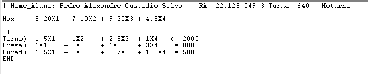
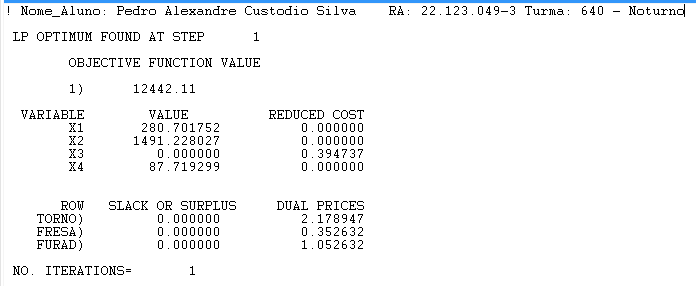
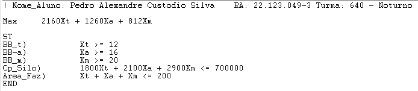
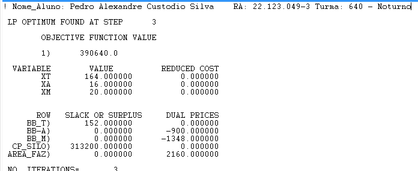
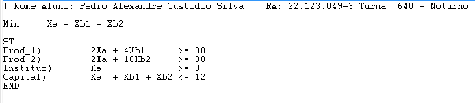
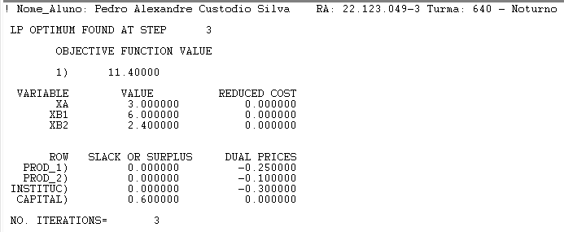
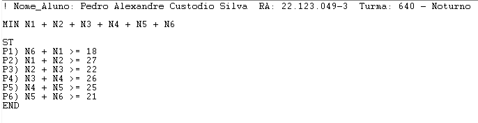
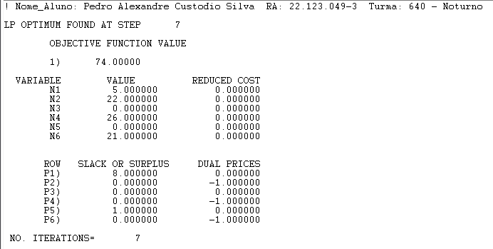

# Atividade 2

**Nome:** Pedro Alexandre Custodio Silva  
**RA:** 22.123.049-3  
**Turma:** 640-Noturno  

## Exercício 1 - Fábrica

### Modelo

### Output

**X1, X2, X3, X4:** Diferentes peças produzidas na fábrica.  
**REDUCED COST:** Quanto seria o aumento necessário aumentar o lucro da peça 3 para que valesse a pena produzi-la.  
**DUAL PRICES:** Quanto o lucro aumentaria se cada equipamento tivesse um minuto a mais de utilização.

## Exercício 2 - Fazenda

### Modelo

### Output

**Xt, Xa, Xm:** Hectares de trigo, arroz e milho (respectivamente).  
**BB_t, BB_a, BB_m:** Hectares de produção pertencentes ao Banco do Brasil das produções de trigo, arroz e milho (respectivamente).  
**Cp_Silo:** Capacidade de armazenamento do silo (em Kg).  
**Area_Faz:** Area da fazenda (em Hectares).  
**REDUCED COST:** Quanto seria necessário aumentar o lucro por hectare de um dos produtos para que seja viável de ser plantado.  
**DUAL PRICES:** Quando o lucro total seria alterado caso houvesse um hectare a mais de cada produto (no caso da área da fazenda, se houvesse um hectare a mais de área), e para **Cp_Silo** um Kg a mais de capacidade.

## Exercício 3 - Campanha de marketing

### Modelo

### Output

**Xt:** Valor gasto em propaganda na TV (em reais)  
**Xr:** Valor gasto em propaganda no Rádio (em reais)  
**Xj:** Valor gasto em propaganda no Jornal (em reais)  
**Orc_Tot:** Restrição do orçamento total disponível para a campanha  
**Min_TV:** Restrição de gasto mínimo em propaganda na TV  
**Min_Radio:** Restrição de gasto mínimo em propaganda no Rádio  
**Min_Jornal:** Restrição de gasto mínimo em propaganda no Jornal  
**REDUCED COST:** Quanto precisaria aumentar o retorno esperado de cada meio de propaganda para que ele se torne viável de ser utilizado.  
**DUAL PRICES:** Qual seria o impacto no valor gasto total caso a restrição de cada componente fosse incrementada. Por exemplo, quanto aumentaria o retorno total se tivéssemos 1 real a mais no orçamento total.

## Exercício 4 - Alocação de motoristas

### Modelo

### Output

**N1:** Número de motoristas que começam no turno de !:00 ~ 5:00  
**N2:** Número de motoristas que começam no turno de 5:00 ~ 9:00  
**N3:** Número de motoristas que começam no turno de 9:00 ~ 13:00  
**N4:** Número de motoristas que começam no turno de 13:00 ~ 17:00  
**N5:** Número de motoristas que começam no turno de 17:00 ~ 21:00  
**N6:** Número de motoristas que começam no turno de 21:00 ~ 1:00  
**REDUCED COST:** Quanto precisaria aumentar o custo de um turno de motoristas para que ele se torne viável de ser utilizado.  
**DUAL PRICES:** Quanto o custo seria alterado caso houvesse um motorista adicional de cada turno.

## Exercício 5 - Tratamento de Resíduos

## Exercício 6 - Nutrientes

## Exercício 7 - Distribuição de Produtos

## Exercício 8 - Blending de Bebidas