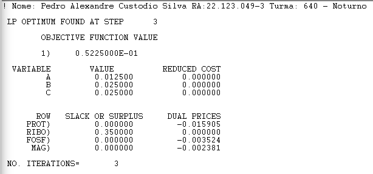

# Atividade 2

**Nome:** Pedro Alexandre Custodio Silva  
**RA:** 22.123.049-3  
**Turma:** 640-Noturno  

## Exercício 1 - Fábrica

### Modelo

### Output

**X1, X2, X3, X4:** Diferentes peças produzidas na fábrica.  
**REDUCED COST:** Quanto seria o aumento necessário aumentar o lucro da peça 3 para que valesse a pena produzi-la.  
**DUAL PRICES:** Quanto o lucro aumentaria se cada equipamento tivesse um minuto a mais de utilização.

## Exercício 2 - Fazenda

### Modelo

### Output

**Xt, Xa, Xm:** Hectares de trigo, arroz e milho (respectivamente).  
**BB_t, BB_a, BB_m:** Hectares de produção pertencentes ao Banco do Brasil das produções de trigo, arroz e milho (respectivamente).  
**Cp_Silo:** Capacidade de armazenamento do silo (em Kg).  
**Area_Faz:** Area da fazenda (em Hectares).  
**REDUCED COST:** Quanto seria necessário aumentar o lucro por hectare de um dos produtos para que seja viável de ser plantado.  
**DUAL PRICES:** Quando o lucro total seria alterado caso houvesse um hectare a mais de cada produto (no caso da área da fazenda, se houvesse um hectare a mais de área), e para **Cp_Silo** um Kg a mais de capacidade.

## Exercício 3 - Campanha de marketing

### Modelo

### Output

**Xt:** Valor gasto em propaganda na TV (em reais)  
**Xr:** Valor gasto em propaganda no Rádio (em reais)  
**Xj:** Valor gasto em propaganda no Jornal (em reais)  
**Orc_Tot:** Restrição do orçamento total disponível para a campanha  
**Min_TV:** Restrição de gasto mínimo em propaganda na TV  
**Min_Radio:** Restrição de gasto mínimo em propaganda no Rádio  
**Min_Jornal:** Restrição de gasto mínimo em propaganda no Jornal  
**REDUCED COST:** Quanto precisaria aumentar o retorno esperado de cada meio de propaganda para que ele se torne viável de ser utilizado.  
**DUAL PRICES:** Qual seria o impacto no valor gasto total caso a restrição de cada componente fosse incrementada.

## Exercício 4 - Alocação de motoristas

### Modelo

### Output

**N1:** Número de motoristas que começam no turno de 1:00 ~ 5:00  
**N2:** Número de motoristas que começam no turno de 5:00 ~ 9:00  
**N3:** Número de motoristas que começam no turno de 9:00 ~ 13:00  
**N4:** Número de motoristas que começam no turno de 13:00 ~ 17:00  
**N5:** Número de motoristas que começam no turno de 17:00 ~ 21:00  
**N6:** Número de motoristas que começam no turno de 21:00 ~ 1:00  
**REDUCED COST:** Quanto precisaria aumentar o custo de um turno de motoristas para que ele se torne viável de ser utilizado.  
**DUAL PRICES:** Quanto o custo seria alterado caso houvesse um motorista adicional de cada turno.

## Exercício 5 - Tratamento de Resíduos

## a)

### Modelo

### Output

## b)

### Modelo

### Output

> **Observação:** Para o item b) não foi possível obter uma solução, pois a "vazão" excede a capacidade das estações.  

**A1, A2, A3, B1, B2, B3:**   Quantidade enviada das fontes A e B para as estações i, ii, e iii.
**FONTE_A e FONTE_B:** "Vazão" das fontes A e B.  
**CAP_I, CAP_II e CAP_III:** Capacidade das estações i, ii e iii.  
**REDUCED COST:** Quanto a quantidade denviada das fontes para cada estação deveriam ser reduzidas para que fosse viável realizar o envio.  
**DUAL PRICES:** Quanto cada valor deveria ser alterado para que fosse possível enviar uma unidade a mais de resíduo de cada fonte, ou então qual seria o aumento necessário na capacidade de uma estação para que ela recebesse mais um envio de resíduo.  

## Exercício 6 - Nutrientes

### Modelo

### Output

**A, B, C:** Quantidade (em Kg) de cada um dos grãos na dieta.  
**PROT:**   Unidades de proteína por Kg de cada grão.
**RIBO:**   Unidades de riboflavina por Kg de cada grão.
**FOSF:**   Unidades de fósforo por Kg de cada grão.
**MAG:**    Unidades de magnésio por Kg de cada grão.
**REDUCED COST:** Quanto precisaria aumentar o valor de cada nutriente para se torne viável adicionar uma unidade a mais dele na dieta.  
**DUAL PRICES:** Quanto o custo total da dieta seria alterado caso a restrição de cada nutriente fosse incrementada.

## Exercício 7 - Distribuição de Produtos

## a)

### Modelo

### Output

## b)

### Modelo

### Output

**PiLj:** Viagens partindo do porto i para a loja j.  
**LOJAn:** soma das viagens para a loja n, restrito pela razão entre demanda da loja e capacidade dos caminhões.
**REDUCED COST:** Quanto precisaria aumentar o custo de uma viagem para que ela se torne viável de ser realizada.
**DUAL PRICES:** Quanto o custo total seria alterado caso a restrição de cada loja fosse incrementada.

## Exercício 8 - Blending de Bebidas

### Modelo

### Output

**A, B, C:** Quantidade (em L) vendida de cada mistura.  
**Si:** Quantidade de Sirney usada para produzir cada mistura (mistura = i).  
**Hi:** Quantidade de Hangover usada para produzir cada mistura (mistura = i).
**Oi:** Quantidade de Olddrunk usada para produzir cada mistura (mistura = i).
> **Obs**: tirei o 'X' das variáveis de decisão do enunciado pra facilitar a leitura.

**MIX_i:** Soma das quantidades de Sirney, Hangover e Olddrunk usadas para produzir a mistura (mistura = i).
**QTD_i:** Quantidade de de cada malte utilizada (malte = i).
**COMP_i:** Restrições de composição das misturas quanto à % dos maltes.
**REDUCED COST:** Quanto precisaria aumentar o preço de venda de cada mistura para que ela se torne viável de ser produzida.  
**DUAL PRICES (para QTD_i):** Qual seria o impacto no lucro total caso a quantidade de cada malte fosse incrementada.
**DUAL PRICES (para COMP_i):** Qual seria o impacto no lucro total caso a restrição de composição de cada mistura fosse incrementada.
